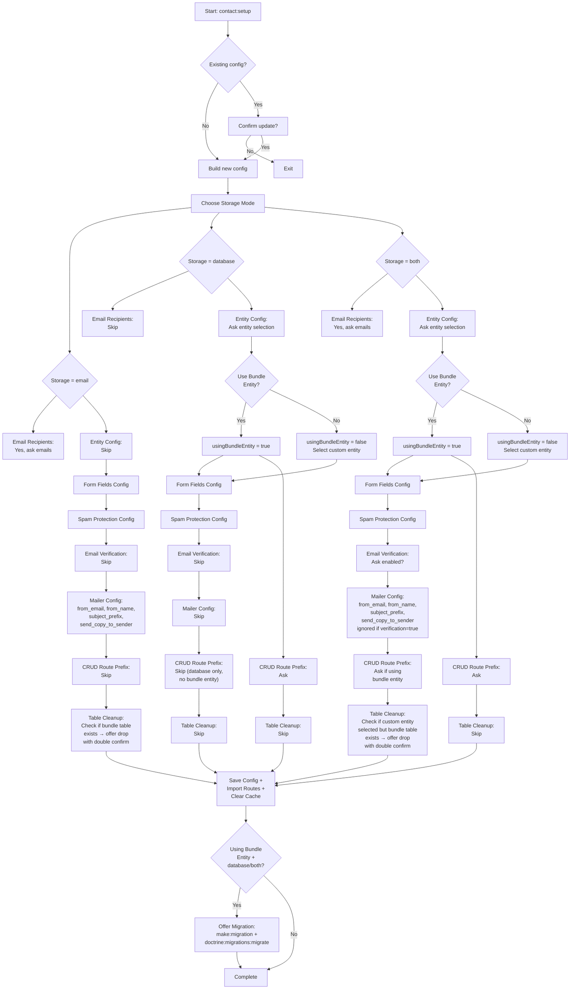

# Setup Wizard Flow & Test Matrix

This document outlines the complete decision flow of the `contact:setup` wizard and provides a comprehensive testing matrix for all configuration combinations.

## Decision Flow Diagram



## Configuration Combinations Matrix

| # | Storage | Entity Type | Email Verification | send_copy_to_sender | Bundle Table | Routes | CRUD | Migrations | Table Cleanup |
|---|---------|-------------|---------------------|---------------------|--------------|--------|------|-----------|---------------|
| 1 | email | - | - | ✓ (asked) | Check→Drop | ✓ | ✗ | ✗ | if exists |
| 2 | database | Bundle | - | ✗ (skipped) | Create | ✓ | ✓ | ✓ | ✗ |
| 3 | database | Custom | - | ✗ (skipped) | Check→Drop if switching | ✓ | ✗ | ✗ | if switching |
| 4 | both | Bundle | Enabled | ✓ (always true) | Create | ✓ | ✓ | ✓ | ✗ |
| 5 | both | Bundle | Disabled | ✓ (asked) | Create | ✓ | ✓ | ✓ | ✗ |
| 6 | both | Custom | Enabled | ✓ (always true) | Check→Drop if switching | ✓ | ✗ | ✗ | if switching |
| 7 | both | Custom | Disabled | ✓ (asked) | Check→Drop if switching | ✓ | ✗ | ✗ | if switching |

**Legend:**
- **Storage**: email-only, database-only, or email+database
- **Entity Type**: Bundle-provided or custom (user's own entity)
- **Email Verification**: Only relevant in "both" mode
- **send_copy_to_sender**: Sender receives copy of admin notification (if not using verification)
- **Bundle Table**: Whether contact_message table is created/checked/dropped
- **Routes**: Form routes imported to config/routes.yaml
- **CRUD**: Admin CRUD routes for message management (only bundle entity)
- **Migrations**: Doctrine migrations generated and offered
- **Table Cleanup**: Double-confirmation drop of bundle table if redundant

## Test Scenarios & Checklist

### Scenario 1: Fresh Install, Email-Only Mode
**Choices:**
- Storage: `email`
- Recipients: `admin@example.com`
- Form Fields: default or custom
- Spam Protection: base only, or with captcha

**Expected Results:**
- [ ] `config/packages/contact_us.yaml` created with storage=email
- [ ] Form routes imported to `config/routes.yaml`
- [ ] No CRUD routes
- [ ] No database migration needed
- [ ] No table cleanup offered (first install)
- [ ] Form available at `/contact`
- [ ] Admin receives email on submission

---

### Scenario 2: Fresh Install, Database-Only Mode (Bundle Entity)
**Choices:**
- Storage: `database`
- Entity: Bundle's ContactMessageEntity
- Form Fields: default or custom
- Spam Protection: base only, or with captcha
- CRUD Route Prefix: `/admin/contact` (default)

**Expected Results:**
- [ ] `config/packages/contact_us.yaml` created with storage=database
- [ ] Form routes imported to `config/routes.yaml`
- [ ] CRUD admin routes imported with prefix `/admin/contact`
- [ ] `entity_class` set to bundle entity
- [ ] Doctrine migration offered (user accepts or runs manually)
- [ ] After migration: admin routes available at `/admin/contact`
- [ ] Form available at `/contact`
- [ ] Messages saved to database, no email sent

---

### Scenario 3: Fresh Install, Database-Only Mode (Custom Entity)
**Choices:**
- Storage: `database`
- Entity: User's custom entity (e.g., `App\Entity\ContactSubmission`)
- Form Fields: auto-detect from entity or custom
- Spam Protection: base only, or with captcha
- CRUD Route Prefix: not asked (custom entity)

**Expected Results:**
- [ ] `config/packages/contact_us.yaml` created with storage=database
- [ ] Form routes imported to `config/routes.yaml`
- [ ] No CRUD routes (custom entity, user handles their own)
- [ ] `entity_class` set to custom entity
- [ ] No migration offered (custom entity already exists)
- [ ] Form available at `/contact`
- [ ] Messages saved to custom entity table, no email

---

### Scenario 4: Fresh Install, Both Mode (Bundle Entity, Verification ON)
**Choices:**
- Storage: `both`
- Recipients: `admin@example.com`
- Entity: Bundle's ContactMessageEntity
- Email Verification: `enabled`
- Form Fields: default or custom
- Spam Protection: base only, or with captcha
- CRUD Route Prefix: `/admin/contact` (default)

**Expected Results:**
- [ ] `config/packages/contact_us.yaml` created with storage=both, email_verification.enabled=true
- [ ] Form routes imported to `config/routes.yaml`
- [ ] CRUD admin routes imported with prefix `/admin/contact`
- [ ] `entity_class` set to bundle entity
- [ ] Doctrine migration offered
- [ ] After form submission:
  - [ ] Message saved as unverified (verified=false)
  - [ ] Sender receives verification email with link + message preview
  - [ ] Admin does NOT receive email yet
  - [ ] Sender clicks verification link
  - [ ] Message marked as verified (verified=true)
  - [ ] Admin receives notification email
  - [ ] Sender does NOT receive another copy (already got verification email)
  - [ ] Verification success page displays

---

### Scenario 5: Fresh Install, Both Mode (Bundle Entity, Verification OFF, send_copy=ON)
**Choices:**
- Storage: `both`
- Recipients: `admin@example.com`
- Entity: Bundle's ContactMessageEntity
- Email Verification: `disabled`
- send_copy_to_sender: `true`
- Form Fields: default or custom
- Spam Protection: base only, or with captcha
- CRUD Route Prefix: `/admin/contact` (default)

**Expected Results:**
- [ ] `config/packages/contact_us.yaml` created with storage=both, email_verification.enabled=false, send_copy_to_sender=true
- [ ] After form submission:
  - [ ] Message saved as verified (verified=true)
  - [ ] Admin receives notification email
  - [ ] Sender receives CC'd copy of admin notification
  - [ ] Success page displays immediately (no verification step)

---

### Scenario 6: Upgrade: Email → Database (Bundle Entity)
**Previous Config:** storage=email
**New Choices:**
- Storage: `database` (changed from email)
- Entity: Bundle's ContactMessageEntity
- CRUD Route Prefix: `/admin/contact`

**Expected Results:**
- [ ] Old config updated to storage=database
- [ ] Old email table check offered → **double confirmation + code**
- [ ] If confirmed: old table dropped
- [ ] New CRUD routes imported
- [ ] Migration offered for bundle entity
- [ ] After migration: admin can view old contact emails if any were saved in transition

---

### Scenario 7: Upgrade: Database (Bundle) → Database (Custom Entity)
**Previous Config:** storage=database, entity=bundle
**New Choices:**
- Storage: `database` (unchanged)
- Entity: Custom entity (changed from bundle)
- CRUD Route Prefix: not asked

**Expected Results:**
- [ ] Old config updated to point to custom entity
- [ ] Bundle table check offered → **double confirmation + code**
- [ ] If confirmed: old bundle table dropped
- [ ] No CRUD routes (custom entity)
- [ ] No migration offered
- [ ] Form uses new custom entity
- [ ] Old messages in dropped table are lost (warned by double confirmation)

---

### Scenario 8: Upgrade: Both (Bundle, Verification OFF) → Both (Bundle, Verification ON)
**Previous Config:** storage=both, email_verification.enabled=false
**New Choices:**
- Storage: `both` (unchanged)
- Entity: Bundle's ContactMessageEntity (unchanged)
- Email Verification: `enabled` (changed from disabled)

**Expected Results:**
- [ ] Old config updated with email_verification.enabled=true
- [ ] No table cleanup offered (same entity)
- [ ] New submissions now require verification
- [ ] Old verified messages remain in database as-is
- [ ] Admin behavior changes for new submissions (only after sender verifies)

---

### Scenario 9: Upgrade: Both (Bundle) → Email (Drop Old Table)
**Previous Config:** storage=both, entity=bundle
**New Choices:**
- Storage: `email` (changed from both)
- Recipients: keep existing or update

**Expected Results:**
- [ ] Old config updated to storage=email
- [ ] Bundle table check offered → **double confirmation + code**
- [ ] If confirmed: bundle table dropped (including all old messages)
- [ ] No CRUD routes
- [ ] Form reverts to email-only
- [ ] Old messages in database are deleted

---

### Scenario 10: Fresh Install, Non-Interactive Mode
**Command:** `php bin/console contact:setup --no-interaction`

**Expected Results:**
- [ ] All defaults applied (both mode, bundle entity, no verification, base spam protection)
- [ ] `config/packages/contact_us.yaml` auto-created
- [ ] Routes auto-imported
- [ ] Cache cleared
- [ ] Migration offered (user can run manually)
- [ ] No prompts, no double confirmations (auto-complete)

---

## Test Execution Checklist

Use this checklist when running full regression:

- [ ] Scenario 1: Email-only (fresh)
- [ ] Scenario 2: Database-only + Bundle (fresh)
- [ ] Scenario 3: Database-only + Custom (fresh)
- [ ] Scenario 4: Both + Bundle + Verification ON (fresh)
- [ ] Scenario 5: Both + Bundle + Verification OFF + send_copy (fresh)
- [ ] Scenario 6: Upgrade email → database
- [ ] Scenario 7: Upgrade database (bundle) → database (custom)
- [ ] Scenario 8: Upgrade both (no verify) → both (verify)
- [ ] Scenario 9: Upgrade both → email (with drop)
- [ ] Scenario 10: Non-interactive mode

**Additional Checks for Each:**
- [ ] Config file syntax and structure
- [ ] Routes properly imported
- [ ] Cache cleared successfully
- [ ] Form renders and works
- [ ] Email sending (if applicable)
- [ ] Database operations (if applicable)
- [ ] CRUD admin (if applicable)
- [ ] Migrations generated & runnable (if applicable)
- [ ] Table cleanup with double confirmation (if applicable)

---

## Dev Mode: Auto-Sync Configuration

For development environments, the bundle provides an optional **auto-sync** feature that automatically applies configuration changes when you run `cache:clear`. This eliminates the need to re-run the setup wizard after manual YAML edits.

### Enabling Auto-Sync

Add the following to your `config/packages/contact_us.yaml`:

```yaml
# Only in dev environment
when@dev:
    contact_us:
        dev:
---

## Dev Mode: Auto-Sync Configuration

For development environments, the bundle provides an optional **auto-sync** feature that automatically detects and handles configuration changes when you run `cache:clear`. This eliminates the need to re-run the setup wizard after manual YAML edits.

### Enabling Auto-Sync

Add the following to your `config/packages/contact_us.yaml`:

```yaml
contact_us:
    # ... other config ...
    dev:
        auto_sync: true
```

### What Auto-Sync Does

When `dev.auto_sync: true` and `kernel.debug=true`, during every `cache:clear` (in the cache warmup phase):

| Config Change | Auto-Sync Action |
|--------------|------------------|
| Storage: `database/both` → `email` | Logs info about unused table, suggests manual removal |
| Storage: `email` → `database/both` | Creates table via migration if missing |
| `fields` changed | Logs notification, form uses new fields on next request |
| `mailer` changed | Logs notification, mailer uses new settings |
| `entity_class` changed | Storage uses new entity class |

### Important Notes

1. **Production Safety**: Auto-sync only activates when:
   - `kernel.debug = true` (dev environment)
   - `dev.auto_sync = true` in config
   
2. **Table Operations**: 
   - Switching **to email-only**: Logs a message about the unused table with suggestions
   - Switching **to database/both**: Automatically runs migrations if table is missing
   - For interactive table drop (with confirmation), use `php bin/console contact:setup`
   
3. **State Tracking**: Config state is stored in `var/contact_us_previous_state.json` to detect changes.

4. **Logging**: All auto-sync actions are logged to `var/log/contact_us_auto_sync.log` and also output to console during `cache:clear`.

5. **Preferred Method**: For production deployments, always use the setup wizard:
   ```bash
   php bin/console contact:setup
   ```

### Example Workflow

```bash
# 1. Initial setup via wizard
php bin/console contact:setup

# 2. Enable auto-sync for development
# Edit config/packages/contact_us.yaml and add:
#   dev:
#       auto_sync: true

# 3. Make manual edits to config (e.g., change storage mode)
# Edit config/packages/contact_us.yaml:
#   storage: email  # was: database

# 4. Clear cache - auto-sync kicks in
php bin/console cache:clear

# Output shows during cache warmup:
# [ContactUs Auto-Sync] Storage mode changed: database → email
# [ContactUs Auto-Sync] Storage changed to 'email' - table 'cg_contact_message' is no longer needed...

# 5. When changing back to database:
php bin/console cache:clear

# Output:
# [ContactUs Auto-Sync] Storage mode changed: email → database  
# [ContactUs Auto-Sync] Table 'cg_contact_message' does not exist. Creating...
# [ContactUs Auto-Sync] Migration generated.
# [ContactUs Auto-Sync] Migration executed successfully!
```
